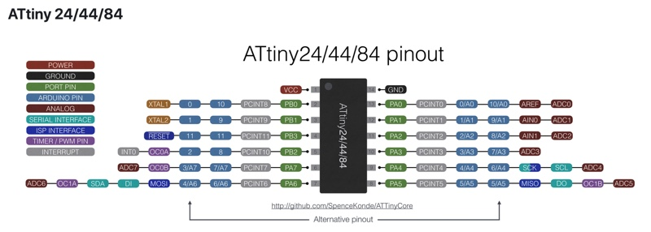

# uvkeysan

## Install Arduino IDE  
Don’t use the app installer. Tested version 1.8.7
[https://www.arduino.cc/en/main/software](https://www.arduino.cc/en/main/software)

## Install Pololu AVR Programmer V2.1 software  
[https://www.pololu.com/docs/0J67/4.1](https://www.pololu.com/docs/0J67/4.1)

Connect the programmer to PC and board and apply power to the board and you should get a green led and 2 flashing orange leds.
Run Pololu config and make a note of the Programming Port.

## In Arduino IDE

### Configure Processor
From the menu : File, Preferences   
In additional Boards Manager URLs enter: http://drazzy.com/package_drazzy.com_index.json  
Then press OK.  

From the menu : Tools, Board, Boards Manager... (at the top of the list)  
Scroll down and select ATTinyCore by Spence Konde version 1.33 and Install  

From the Tools menu select :  
* Board : ATtiny24/44/84
* Chip: ATtiny84
* Clock: 1Mhz internal
* Port: the com port noted in Pololu Config
* Programmer: Atmel STK500 development board (ATTinyCore)

### Install Libraries
From the menu Sketch, Include Library, Manage Libraries...
Search for `Bounce2`, select the library and press the Install button.  
Search for `tone`, select the library and press the Install button.   

## Pins

| Function           | Arduino Pin | Physical Pin | Port  |
| ------------------ |:-----------:|:------------:|------:|
|buzzerPin           |8            |5             |PB2    |
|switchPin           |3            |10            |PA3    |
|ledPinOrange        |10           |2             |PB0    |
|ledPinRed           |9            |3             |PB1    |
|UVPin               |7            |6             |PA7    |
|photo_diode_internal|A1           |12            |PA1    |
|photo_diode_external|A2           |11            |PA2    |
|SCK                 |4            |9             |PA4    |
|MOSI                |6            |7             |PA7    |
|MISO                |5            |8             |PA5    |
|RESET               |11           |4             |PB3    |
|VCC                 |             |1             |       |
|GND                 |             |14            |       |

